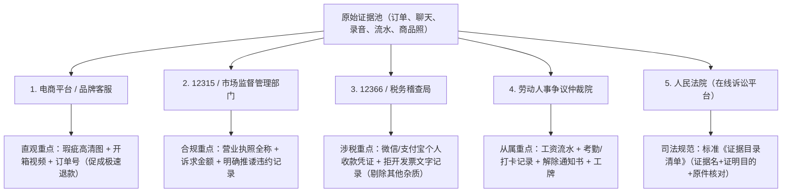

# 证据整理、固化与多机构差异化提交指引

> **证据核心法则**：
> 维权从本质上是“事实与证据的博弈”。普通人维权受挫，80% 的原因不是没有道理，而是**证据形式不合法、关键链条缺失、或者向错误的机构递交了无关的信息**。
> 代理在全流程中，应时刻引导用户**“先固化、再交涉、按机构分流呈递”**。

---

## 一、证据的三大黄金固化标准（合法性、真实性、关联性）

### 1. 聊天记录与电子屏幕录像（避免被认定为可伪造截图）
- **致命误区**：只截取几句对话文字，没有截到对方头像背后的真实账号、商户主体与具体时间。
- **规范的“一镜到底”录屏法**：
  1. 下拉手机控制中心，显示**当前系统真实日期与时间**、当前网络状态（4G/5G/Wi-Fi）；
  2. 打开对应 App（微信/淘宝/京东/拼多多/飞书/钉钉）；
  3. 点开涉事商家/人员的主页，进入其**“店铺资质/营业执照信息”**页面，停留 2 秒；
  4. 返回订单页面，完整展示**订单编号、实付金额、交易时间、收货地址与物流单号**；
  5. 进入聊天窗口，从顶部**从上往下滑动**，展示完整上下文，重点在对方承认瑕疵、拒绝退款或推诿的句子上停留；
  6. 结束录屏并备份至网盘或移动硬盘。

### 2. 通话录音的合法性防线（《民事诉讼证据规定》第九十五条）
- **合法有效的前提**：
  - 不得侵犯他人合法权益或违反法律禁止性规定（不得在他人私密空间窃听或安装非法间谍设备）；
  - 双方当事人之间的正常通话、交涉录音，**在司法实践中完全合法有效**。
- **标准录音话术固定法（开场必须明确双方身份与事实）**：
  > “请问是 [公司全称/店铺名称] 售后负责处理我 [具体订单号] 的客服主管 [姓名或工号] 吗？”  
  > “关于我 [日期] 购买的 [商品型号]，目前 [具体瑕疵问题]，你们现在正式的答复是坚决不退款，对吗？”  
  > “请问贵司坚持不退的依据是什么？是你们内部规定的拆封不退吗？”

### 3. 开箱与实物检测的证据锁定
- **未开箱或疑似瑕疵件**：录制“一镜到底”拆箱视频，清晰拍摄面单信息、封箱胶带完整性、破损位置特写。
- **耐用数码/电器（适用举证责任倒置）**：
  - 依据《消保法》第二十三条第三款，六个月内耐用品出现瑕疵，由商家举证。
  - 用户只需固定**“瑕疵客观存在”**的视频/照片，切勿听信商家诱导“自费去第三方机构检测”。

---

## 二、面向不同机构与部门的“差异化证据包”建议

不同机构的法定职能和关注焦点截然不同。向部门递交证据时，**严禁一股脑倾倒全部资料，必须根据机构审查要件进行精准筛选与剪裁**：



---

### 1. 提交给【电商平台客服 / 品牌官方客诉】
- **审查核心**：平台介入规则、退货时限、商品直观可见的瑕疵。
- **推荐证据组合**：
  - ✔️ 实物瑕疵特写图（画红圈标明对比）；
  - ✔️ 快递一镜到底开箱视频；
  - ✔️ 售前客服做出的特殊承诺或商品详情页虚假宣称截图。
- **提示**：不需要提供冗长法条分析，重点在“直观、实锤、符合平台售后判责标准”。

---

### 2. 提交给【全国 12315 平台 / 市场监督管理所】
- **审查核心**：经营主体适格性（归谁管）、消费者真实权益受损事实、是否存在违法经营线索。
- **必备证据清单**：
  1. **被投诉人准确主体资格证明**：
     - 在平台查到的商家营业执照公示截图（含企业全称、统一社会信用代码、经营地址）；
  2. **交易成立与付款凭证**：
     - 包含交易对手信息的支付订单详情（非单纯扣款短信）；
  3. **曾协商未果的推诿证据**：
     - 客服拒绝履行法定瑕疵担保（如声称“特价不退”、“拆封不退”）的明确文字截图或电话录音摘要；
  4. **涉嫌行政违规证据（若主张行政处罚）**：
     - 广告页面含绝对化用语的截屏、产品外包装无厂名厂址（三无）照片。

---

### 3. 提交给【国家税务总局 12366 / 各省税务稽查局】
- **审查核心**：是否存在不按规定开具发票、隐匿经营收入、私户偷漏税。
- **极简涉税专属证据包（切勿混入商品好坏等琐碎争执）**：
  1. **私户收款铁证**：
     - 向个人微信、个人支付宝或个人银行卡付款的完整电子回单（需显示收款人真实姓名及账号）；
  2. **拒绝开具发票的直接对话记录**：
     - 客服明确表示“不开发票”、“开票需另外加收 6% 税点”、“特价商品不提供发票”的原始聊天截图；
  3. **实际交易订单**：证明该笔私户转账与实际商业消费具有直接对应关系。

---

### 4. 提交给【劳动人事争议仲裁委员会 / 劳动监察大队】
- **审查核心**：劳动关系确立（人身从属性）、用工起止时间、实际工资基数、解除劳动合同的形式与程序。
- **阶梯式证据组合**：
  1. **证明存在劳动关系**：
     - 银行代发工资流水单（注明“工资/代发”）、个税申报记录、社保缴费明细、带名字和公章的工牌/门禁卡、钉钉/企业微信组织架构截图；
  2. **证明实际劳动报酬**：
     - 连续 12 个月的银行入账流水明细（用以核算经济补偿 N 的基准月均工资）；
  3. **证明违法辞退/未足额支付事实**：
     - 公司的《解除通知书》、HR 谈话录音、强制移出工作群记录；
     - 主张加班费的，需提供系统加班审批记录、考勤打卡记录及下班后工作沟通记录。

---

### 5. 提交给【人民法院（小额诉讼 / 民事起诉）】
- **审查核心**：诉讼请求与证据的证明力、三性（真实性、合法性、关联性）闭环。
- **必须整理为规范的《证据目录清单》**：
  每项证据必须列明：**证据序号、证据名称、证据来源与形式、证明目的、原件核对说明**。

```text
【证据目录清单范本】

原告：[姓名]    被告：[公司名称]
案由：信息网络买卖合同纠纷

序号 | 证据名称 | 形式/页数 | 证明目的
---|---|---|---
证据1 | 订单详情及微信支付电子凭证 | 打印件 / 2页 | 证明原告于X年X月X日向被告购买涉案商品并支付款项4299元，双方买卖合同依法成立生效。
证据2 | 开箱录像及瑕疵特写照片 | 刻录光盘 / 1份 | 证明被告交付的标的物存在重大性能瑕疵，合同目的无法实现。
证据3 | 客服沟通记录及拒绝退货截图 | 打印件 / 4页 | 证明原告在法定期限内提出质量异议，被告违法以“已拆封”为由拒绝退款，构成根本违约。
证据4 | 被告国家企业信用信息公示报告 | 打印件 / 3页 | 证明被告合法的工商登记主体资格与住所地。
```

---

## 三、证据整理与管理实战原则

1. **原件永远在自己手中**：
   - 递交给行政机关或法院的均是复印件或电子上传件，原件（原始手机载体、原包装、原始票据）必须妥善封存，待庭审或执法人员现场质证时出示。
2. **多重云端与物理备份**：
   - 录屏与录音生成后，第一时间同步至百度网盘/微云/本地 U 盘，重命名为：`YYYYMMDD_事件_当事人_证据内容.mp4`。
3. **防止二次污染**：
   - 涉嫌质量问题的实物商品，拍照录像取证后放入密封袋封存，切勿继续使用或私自拆解维修，以免破坏原始瑕疵形态。

---

## 四、残缺证据与逆风局补救协议 (Reverse-Wind Protocol)

现实中，绝大多数普通人在遭遇侵害时并没有预先录音或保存证据的意识，常常面临“证据已删除/无录音/被踢群”的被动逆风局。代理应指导以下三大补救绝技：

### 1. 硬件限制破局：针对 iPhone 无法直接通话录音
- **绝技 A（双机外放录制）**：使用一台备用手机（家人/朋友手机）或电脑开启录音机 App，当前 iPhone 开启免提外放，两台设备保持 20cm 距离通话录制；
- **绝技 B（文字复核追认法）**：通话结束后 5 分钟内，立即向对方微信/短信发送一条文字确认消息：
  > “李主管，刚才电话沟通中您表示【因为商品已经拆封/公司今年效益不好，所以坚决不能退款/不给补偿】，并要求我【自费去送检/主动写辞职信】，请问我的理解是否准确？”
  - **法律效力**：对方如果回复“对”、“这是公司规定”，该文字截屏即成为对先前通话内容的绝对有效追认！即使对方不回复，结合通话详单记录，亦形成间接推论证据链。

### 2. 线上痕迹销毁破局：针对商家修改详情页或商品下架
- **调取“交易快照”**：指导用户在淘宝、京东、拼多多等已买到的宝贝订单中，点击商品名称旁的**“交易快照”**字样。该快照是平台服务器自动固化的用户拍下瞬间原始网页，商家事后修改详情、删除“买一送一”或下架商品均无法篡改交易快照。

### 3. 被公司秒踢工作群、停用企业邮箱/飞书之破局
- **行政与金融数据替代法**：
  1. 打开个人所得税 App $\rightarrow$ 收入纳税明细查询，导出盖有国家税务总局电子印章的纳税记录（证明用人单位扣缴义务与雇佣关系）；
  2. 登录当地人社局官网或微信公众号，下载打印《社会保险个人权益记录单》（证明社保缴纳主体）；
  3. 前往银行柜台打印个人工资卡明细，要求银行加盖业务公章，核查备注栏中是否有“工资”或公司简称。

### 4. 诱导对方“自认违法事实”的沟通话术设计
当手中没有直接证据证明对方违约或违法辞退时，切勿直接摊牌，而是设计一段“请教式/核实式”沟通，诱导对方在聊天中自认：
> **劳动争议自认诱导话术示范**：  
> “王总，上周五您约谈我让我做到本月底离职，说公司不打算给 N 补偿。我这几天很焦虑，想再次跟您核实下，如果我配合交接，这几天的离职证明公司能否按时开具？”  
> （对方只要回复：“离职证明按时给，补偿确实没有”，即铁证如山自认了单方解除用工的事实！）

