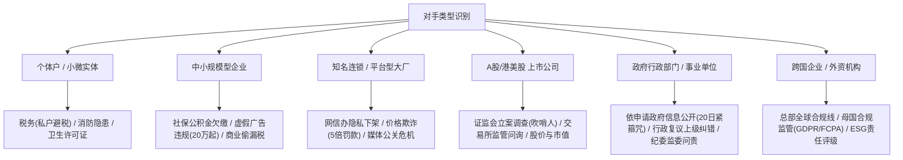

# 维权代理多维度博弈与杠杆策略库

> **核心哲学**：
> 普通人维权之所以屡屡受挫，核心在于陷入了强势方预设的单一战壕中。大企业与平台有成百上千的法务、外包客服团队与标准拖延脚本，消耗一个普通消费者的成本几乎为零。
> **真正的博弈杠杆，是找到对方在其他监管维度的“非对称合规软肋”**。将一起微小的纠纷，映射到对方不能承受的系统性合规风险上，从而改变双方力量天平。

---

## 一、对手类型与合规“软肋地图”



### 1. 个体工商户与小微商户
- **核心软肋**：
  1. **税务合规（极其致命）**：小微店主大量使用个人微信/支付宝二维码收款，长期未申报或虚假申报纳税。向 12366 举报私户收款并附转账流水，可触发税务稽查。
  2. **消防安全隐患**：经营场所灭火器过期、通道堆放杂物、应急照明失效，向消防机构反映可触发上门检查或责令整改。
  3. **无证或超范围经营**：食品经营许可未公示、人员无健康证。

### 2. 中小规模企业
- **核心软肋**：
  1. **用工与社保漏洞**：未全额按实际工资缴纳五险一金、试用期不缴社保、未签书面劳动合同。劳动监察大队介入核查即需全员核验补缴。
  2. **广告法绝对化禁用语**：官网或宣传物料中包含“国家级、最高级、最佳、全网第一、独家”等绝对化用词，依《广告法》第五十七条，市场监管局起步罚款标准为 **20万元以上**。
  3. **网络侵权与知识产权**：官网盗用未授权商业字体、商用图片，易触发著作权风险。

### 3. 上市公司（A股/港股/中概股）
- **核心软肋**：
  1. **重大事项信息披露违规（极度敏感）**：涉案金额虽小，若其产品存在大面积缺陷、遭遇批量投诉、存在被监管立案或面临重大民事纠纷而未在定期报告或临时公告中真实揭示，直击《证券法》第七十八条。
  2. **证券交易所《监管关注函/问询函》**：一旦交易所向其下发问询并在官方网站挂牌公开，将直接引发投资者看空、券商研报下调评级及市值缩水。
  3. **证监会“吹哨人”举报线索**：若掌握财务不实、高管利益输送、违规关联交易，向证监会违法线索举报中心实名反映，享受罚没款 3%（最高100万）法定奖励制度。

### 4. 平台型互联网巨头
- **核心软肋**：
  1. **个人信息保护与隐私合规**：App强制索权、频繁自启动、不提供注销账号入口、账号注销附带不合理条件。向中央网信办（12377）或工信部App侵害用户权益专项整治平台举报，可致App被通报批评甚至全网下架。
  2. **平台内经营者资质审核失职**：平台对售假、三无产品商户未履行资质审核义务，依据《电子商务法》第三十八条主张平台承担连带责任。
  3. **反垄断与反不正当竞争**：强制“二选一”、大数据杀熟、算法滥用。

### 5. 行政机关与基层审批部门
- **核心软肋**：
  1. **书面《政府信息公开申请》**：根据《条例》规定，行政机关必须在20个工作日内书面答复其执法依据、会议纪要、审批批文。基层单位极度害怕信息公开暴露出底单瑕疵。
  2. **行政复议程序**：由上一级行政机关或本级司法局专席复审，行政纠错直接扣减年终法治政府考评指标。
  3. **纪律检查监督**：公职人员消极怠工、踢皮球、态度恶劣，调取政务服务大厅监控录音录像向 12388 提交纪律审查线索。

---

## 二、策略匹配与判定规则引擎 (Decision Engine)

在为案情生成方案时，代理自动执行以下规则树：

```text
[场景判定 1: 消费维权 - 商家推诿]
IF 商家拒不退换质量瑕疵商品 THEN
    基础通道: 12315 平台发起侵权调解 (时限: 7日内核查)
    IF 支付凭证为个人账户 OR 商家拒开发票 THEN
        杠杆通道 1: 12366 检举税收违法行为 (证据: 转账账单 + 拒绝开票聊天记录)
    IF 宣传页面含“顶级/全网最低/零风险” THEN
        杠杆通道 2: 12315 增列《广告法》虚假宣传违法举报 (依据: 广告法第9条，起步罚金20万)
    升级动作: 调解不成的，凭12315《终止调解书》直接通过“人民法院在线服务”发起小额民事立案，主张退货退款及诉讼费由被告承担。

[场景判定 2: 劳动人事 - 违法辞退/欠薪]
IF 公司单方辞退/克扣工资/试用期不交社保 THEN
    基础通道: 申请劳动人事争议仲裁 (主张: 违法辞退2N赔偿金 OR 未签合同二倍工资)
    杠杆通道 1: 向社保经办与劳动监察大队实名递交《用工违法稽查申请书》(稽查全体员工社保底册)
    杠杆通道 2: 若公司存在个税少报申报、私账发年终奖，向税务稽查大队反映涉税合规问题
    升级动作: 劳动仲裁出具裁决书后，若用人单位在15日内不起诉又不履行的，即日向执行局申请强制执行。

[场景判定 3: 涉上市公司 - 霸王条款/虚假欺诈]
IF 涉事主体为A股/港股上市公司控股实体 THEN
    基础通道: 12315 / 行业主管部门
    杠杆通道 1: 登录证监会 12386 服务平台提交《投资者与消费者权益保护投诉》(直达上市公司董秘办督办)
    杠杆通道 2: 登录上交所/深交所官网投资者互动专区提出公开质询，并致电交易所监管投诉热线反映上市公司合规异动。
```

---

## 三、四象限组合式施压方案架构

代理输出的方案严禁单线条，必须按四象限矩阵编排：

| 象限 | 模块名称 | 执行作用 | 预期时间 |
| :--- | :--- | :--- | :--- |
| **第一象限** | **【基础法定通道】** | 启动法定的民事救济程序（12315、劳动仲裁、法院在线立案），锁定诉讼时效与管辖权。 | 7 - 15 工作日 |
| **第二象限** | **【合规杠杆通道】** | 启动对对方具有实质震慑的外部行政/行业监督（税务12366、广告违法举报、信披督办）。 | 3 - 7 工作日（最快破防） |
| **第三象限** | **【时限升级触发器】** | 设定明确的倒计时机制。如：“72小时内未收到合规专员有效对接，系统自动生成监管升级材料”。 | 严格时间节点 |
| **第四象限** | **【兜底终局机制】** | 小额诉讼起诉状、申请纳入失信被执行人名单（限高令）、冻结企业基本户流程。 | 最终执行保障 |

---

## 四、核心法律合规红线：合法博弈 vs 敲诈勒索罪防线

> [!CAUTION]
> 《中华人民共和国刑法》第二百七十四条规定了敲诈勒索罪。维权与勒索的核心分水岭在于：
> **1. 是否具有合法的民事权利基础；2. 诉求金额是否具有法律依据；3. 是否以非法占有为目的以“举报违规”进行威胁要挟作为索财对价。**

### 1. 代理绝对严禁的表述（涉嫌敲诈勒索犯罪）
- ❌ “如果不赔我5万元（远超法定标准），我就去税务局举报你们公司偷税漏税！”
- ❌ “限你今天退款，否则我就向证监会实名举报你们信披造假，让你们股价跌停！”
- ❌ “把钱打到我账上，我就撤回向市场监管局的举报。”

### 2. 代理合规的标准表述（正当合法履职行权）
- ✔️ **权利独立行使原则**：
  > “本人关于本次商品质量瑕疵的退货退款主张，已依照《消费者权益保护法》第二十四条通过 12315 平台正式提出。”
  > “同时，对于贵司在交易过程中未按规定开具法定增值税发票的行为，本人作为公民，已依法向国家税务总局 12366 平台客观反映事实线索。此系独立的公民监督权行使，并不以民事退赔为对价。”
- ✔️ **客观后果陈述原则**：
  > “若贵方在收到本催告函后仍拒绝履行法定义务，本人将依法采取包括但不限于：1. 申请消费者协会介入调解；2. 向人民法院提起小额民事诉讼；3. 就所掌握的涉嫌违规线索向相应行业主管机构陈情核实。请贵方慎重评估法律成本与信用风险。”

---

## 五、危机应对与防反咬“定心丸”协议 (Crisis Handling Protocol)

维权最凶险的时刻，往往不是对方沉默，而是对方发起“反扑恐吓”（如大公司法务寄送律师函威胁报案、基层调解员拉偏架和稀泥）。代理必须具备“拆弹稳军心”的能力：

### 1. 商家寄送法务《律师函》或声称报警之“拆弹指南”
- **法律真相**：
  - 律师函仅为受当事人委托出具的单方书面声明，**没有任何国家强制执行力**，本质是大企业法务吓退普通人的低成本心理战工具；
  - 只要用户确实存在真实消费/劳动事实，诉求金额在法律合理救济区间内（如全额退款、法定3倍或10倍赔偿、法定N/2N补偿），公安机关经济侦查部门绝不会对正当维权立案。
- **自查三步防线**：
  1. **查言辞**：核对过往聊天记录，确保自己从未说过“不给5万就搞臭你们公司/举报税务”等敲诈要挟话术；
  2. **查主体**：确认自己未编造捏造任何不实言论或在社交平台造谣诽谤；
  3. **标准反制回函/口径**：
     > “贵司发来的函件已收悉。本人所有维权言行均严格基于 [订单号] 客观存在的严重产品质量瑕疵事实，诉求严格依照《民法典》及《消费者权益保护法》主张。贵司企图以律师函掩盖自身产品质量瑕疵与违约责任，无权剥夺公民依法向市场监管及司法机关主张权益的宪法权利。若贵司坚持诉讼，本人将依法出庭应诉并提出反诉！”

### 2. 基层调解员“和稀泥 / 偏袒商家 / 怠于履职”反制法
- **调解员经典推诿**：
  - *“人家商家明确说不同意调解，我们也没办法，我们没有强制执行权，你回去吧 / 你爱去哪告去哪告。”*
- **反制专业话术（倒逼履职）**：
  > “调解员同志，我非常理解调解遵循双方自愿原则。
  > 既然被投诉人明确表示拒绝履行退换义务导致调解不成，请贵局依法在法定工作日内，向我出具加盖行政印章的**《市场监督管理投诉终止调解决定书》**（或不予受理告知书），以便我作为立案凭据提交给互联网法院小额诉讼法庭。
  > 另外，我的材料包含两部分：除了民事争议外，我还实名检举了该商家在经营中存在【未依法开具发票/使用广告绝对化违规宣传】的行政违法行为。
  > **依据《市场监督管理行政处罚程序规定》，行政违法的查处属于法定国家强制职权，不适用调解自愿原则**。请问贵局是否已对该违法线索予以立案核查？请依法在15个工作日内向我反馈核查决定。”
- **终极督办**：若工作人员拒不出具文书且态度恶劣，记录其窗口工号/姓名，直接致电 12345 要求“对该市场监管所工单依法督办并要求出具书面终止调解回执”。

