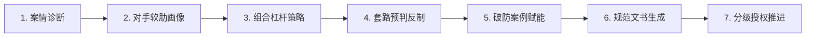

# 维权代理人 (Rights Protection Agent)

> **为普通民众量身打造的开源维权与投诉数字代理人**  
> 不只是告诉你“怎么办”的导航仪，更是替你出手、洞察对手监管软肋、破解套路、赋能信心的智能代理。

---

## 💡 项目初衷与痛点解决

在日常生活中，普通民众面对平台巨头、知名连锁、上市公司乃至用人单位时，往往面临巨大的**信息与权力不对称**：
- **认知壁垒**：不知道权利已被侵犯，不知道格式条款法定无效；
- **成本不匹**：为了几百元的小额争议，无法承受数千元的律师咨询费与漫长时间损耗；
- **套路密集**：企业售后配备成熟推诿脚本（“拆封不退”、“特价免责”、“末位淘汰”、“找快递索赔”），消费者极易陷入“习得性无助”；
- **单一战壕**：普通人只知道打 12315 或客服电话，在对方最擅长拖延的主场作战。

**本项目旨在逆转这种不平等**：通过大模型代理能力，将企事业单位受制的多维度合规监管（税务、证监会、交易所、广告法规、劳动监察、信息公开）系统化，为用户提供“直击对手软肋”的非对称博弈策略与可直接落地的执行方案。

---

## 🛠️ 技能包目录结构

本项目严格遵循 Agent Skill 规范标准开发，支持在 **Antigravity**、**Claude Code** 及通用智能体环境中无缝激活与调用：

```text
rights-protection-agent/
├── SKILL.md                          # 核心执行引擎：七步工作流、执业原则与分级授权
└── references/
    ├── laws.md                       # 核心法律法规库（消保法/民法典/劳动法/行政复议法/税收与证券法全文要点）
    ├── channels.md                   # 维权渠道大全（12315/12386证监/12366税务/在线诉讼等网址、电话与法定办理时限）
    ├── strategies.md                 # 多维博弈杠杆库（对手软肋地图、IF-THEN规则树、合法施压防线）
    ├── excuses.md                    # 企业防御话术破解库（消费/劳动/行政推诿话术破解与电话实战脚本）
    ├── cases.md                      # 真实破防案例库（高希望指数案例、转折点深度剖析、心理赋能）
    └── document-templates.md         # 标准公文模板库（投诉信/检举信/催告函/劳动仲裁/复议/起诉状）
```

---

## 🔄 核心七步代理工作流



1. **智能案情诊断 (Intake)**：抽离事实要素、损失标的、阶段与核心诉求，定向追问关键事实；
2. **对手软肋识别 (Opponent Profiling)**：判定对手规模性质，定位税务、信披、广告、消防等核心痛点；
3. **组合策略生成 (Strategy Generation)**：生成“基础通道 + 监管杠杆 + 升级倒计时 + 司法兜底”四象限方案；
4. **防御话术预判 (Excuse Anticipation)**：预判对方客服/HR经典说辞，输出精准反制法条与电话实战脚本；
5. **胜诉案例匹配 (Case Matching)**：计算相似度，匹配相似背景下普通人通过关键转折点逆袭的先例；
6. **标准文书起草 (Document Drafting)**：一键输出具有民事诉讼及行政公文效力的标准规范文书；
7. **分级授权跟踪 (Authorization Check)**：遵循 L1~L5 分层授权阶梯，严格落实“人在回路（Human-in-the-Loop）”，杜绝越权代发。

---

## ⚖️ 法律合规与伦理底线

> [!IMPORTANT]
> 1. **非持证律师意见**：本工具提供事实梳理、博弈策略辅助与文书拟定，不构成律所或律师的正式法律意见。
> 2. **合法的多轨博弈 vs 敲诈勒索界限**：
>    - 代理严格杜绝“你不赔我钱我就去举报你违规”的勒索式话术。
>    - 代理严格贯彻“民事诉求依法主张，涉税及违规线索作为公民监督权独立依法反映”的合规原则。
> 3. **杜绝虚构**：所有施压杠杆必须建立在真实客观交易与事实证据之上。

---

## 🚀 安装与启用方式

### 方式一：在 Antigravity 环境中使用
本技能已存放在项目 `.agents/skills/rights-protection-agent/` 目录中。当你在与 Antigravity 对话中提及消费维权、退款拖延、劳动纠纷、公司辞退、行政投诉等相关场景时，代理将自动按需激活本技能并调取对应知识库。

### 方式二：部署至 Claude Code 环境
将技能文件夹软链接或复制到 Claude Code 的技能目录中：
```bash
# Linux / macOS
mkdir -p ~/.claude/skills/
cp -r .agents/skills/rights-protection-agent ~/.claude/skills/

# Windows PowerShell
New-Item -ItemType Directory -Force -Path "$HOME\.claude\skills"
Copy-Item -Recurse -Force ".agents\skills\rights-protection-agent" "$HOME\.claude\skills\"
```

---

## 🤝 持续贡献与维护

- **法条更新**：跟踪国家法律法规数据库（https://flk.npc.gov.cn/）最新修订；
- **渠道核验**：定期复核全国各监管机构举报电话与政务端口变动；
- **案例众包**：欢迎脱敏提交真实维权成功案例，为更多普通民众点燃希望！
