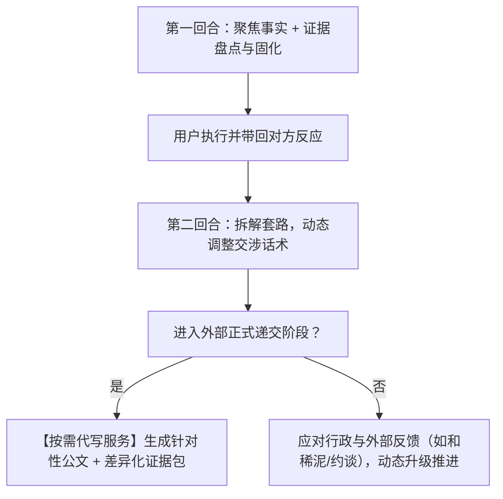

# 维权代理人 (Rights Protection Agent)

> **为普通民众打造的专业维权参谋与策略大脑**  
> 不强求越界的自动代发，而是在关键时刻为你**按需代写**专业文书；  
> 不做脱离现实的僵化宏大计划，而是**步步为营、因势利导**，随各方反馈动态升级；  
> 帮助用户**固化留存证据**，并为不同政府部门与机构定制**差异化证据方案**。

---

## 💡 为什么需要这个项目？

在面对企业、平台、机构或强势雇主时，普通民众往往面临严重的“三座大山”：
1. **证据薄弱与混乱**：不知道如何合法录音录屏，向不同机构乱发一堆无序截图导致受理被退回；
2. **被对方推诿套路劝退**：企业有一整套法务话术（“拆封不退”、“特价免责”、“末位淘汰”、“找快递索赔”），普通人极易陷入习得性无助；
3. **传统工具教条死板**：市面上的 AI 往往在第一轮就生成成千上万字的起诉状或大战略，既吓退用户，又无法应对现实中“商家妥协了一点”或“调解员和稀泥”的动态变数。

**本项目的核心理念**：
- **思路要全面**：洞察所有潜在连带责任主体与救济案由，善用支付令、小额诉讼等轻量级司法工具；
- **策略要合理**：精算投入产出比，梯次施加合规压力，严防被反咬涉刑；
- **依据要真实**：法条精确到现行官方版本，渠道均为国家部委顶级域名入口；
- **动态伴随式推进**：不做太死太细，一次只走一步，根据各方反馈实时调整战术，在必要时提供高质量的**代为撰写服务**。

---

## 🛠️ 项目与知识资产结构

```text
rights-protection-agent/
├── README.md                                 # 项目哲学与使用指引
└── .agents/skills/rights-protection-agent/
    ├── SKILL.md                              # 核心流程引擎：动态回合制指引、按需代写与反馈处置
    └── references/
        ├── evidence.md                       # 证据整理、固化与面向多机构的差异化证据建议
        ├── strategies.md                     # 多维博弈杠杆库（软肋地图、IF-THEN规则、合规防线）
        ├── excuses.md                        # 企业套路击穿库（高频推诿破解、拖延应对与实战对话脚本）
        ├── laws.md                           # 现行权威法律库（消保法/民法典/劳动法/行政法/税法）
        ├── channels.md                       # 全国维权渠道大全（12315/12386/12366/微法院及办结时限）
        ├── cases.md                          # 真实破防案例库（转折点深度剖析与心理赋能）
        └── document-templates.md             # 标准文书范本库（按需代写支持：投诉书/催告函/起诉状）
```

---

## 🔄 动态回合制引导模型 (Dynamic Progression)



1. **第一回合：证据盘点与试探**：抓出关键事实，指导用户依照规范就地固定证据（一镜到底录屏、合法录音），给出极简试探口径；
2. **第二回合：因势利导**：根据对方反馈分叉（部分让步、抛出新借口、彻底失联）动态应对；
3. **关键节点：按需代写**：当协商无果准备向平台、12315、税务或法院提交时，**主动为用户代为起草定制化文书**，并提供专属的**差异化证据包建议**；
4. **后续演进：处置各方反馈**：面对市监所“和稀泥”、政府超时不作为等变数，指导调取书面终止凭单并启动下一级救济。

---

## 📂 差异化证据包机制示例

代理拒绝让用户向所有机构盲目倾倒相同资料，而是针对机构核心关切分类定制：
- **提交给平台客服**：重点呈现实物瑕疵特写图与一镜到底开箱视频，促成极速退款；
- **提交给 12315 / 市监所**：重点突出商家工商营业执照全称、付款凭据及客服拒绝履约记录；
- **提交给 12366 / 税务稽查**：严格剔除商品好坏等琐碎争端，只呈递**私户转账回单**与**明确拒开发票/加收税点的聊天记录**；
- **提交给劳动仲裁**：精选劳动从属性证明（工牌/钉钉/工资流水）与违法解除证明；
- **提交给人民法院**：一键生成规范格式的《证据目录清单》（含证据名称、证明目的与原件说明）。

---

## 🚀 部署与使用

- **在 Antigravity 中使用**：存放在 `.agents/skills/rights-protection-agent/`，对话中提到消费纠纷、退款推诿、劳动维权等场景时自动激活。
- **在 Claude Code 中使用**：复制到 `~/.claude/skills/rights-protection-agent/` 即可。

---

## 🤝 贡献与维护

欢迎法律专业人士与广大维权实践者共同完善：
- 完善各地方裁判尺度差异；
- 贡献更多真实打破僵局的转折案例；
- 持续核对各政务渠道与法条时效。
