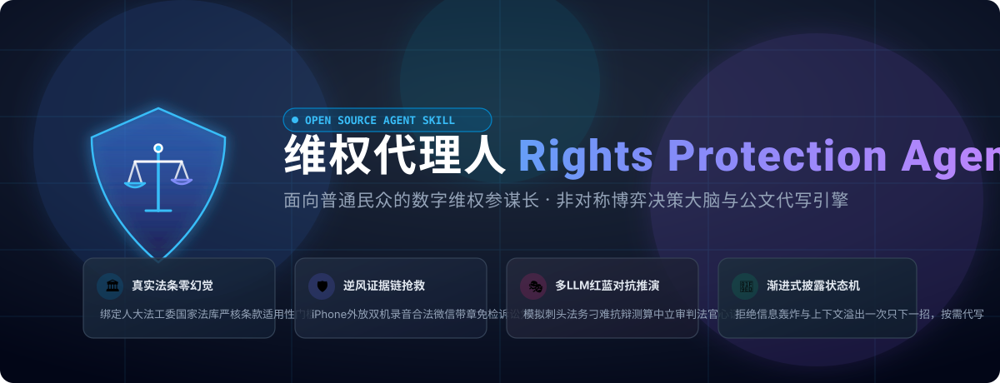
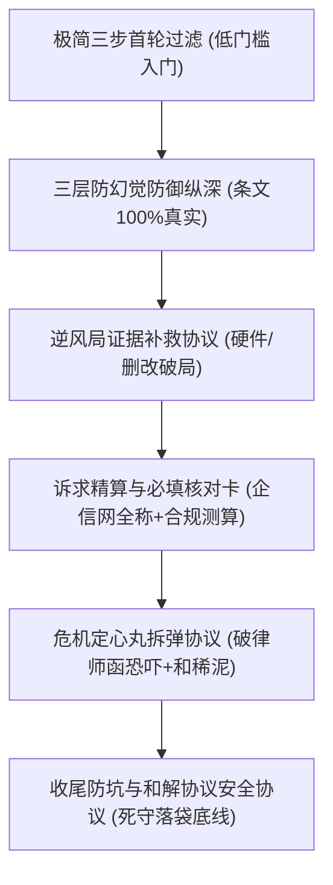
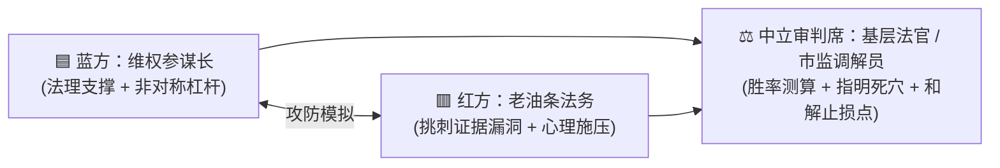

<div align="center">



<br/><br/>

[](https://github.com/JimmyWangJimmy/rights-protection-agent/stargazers)
[](./LICENSE)
[](./CONTRIBUTING.md)
[](#-交互式沙盘工作台-interactive-web-ui)
[](https://github.com/JimmyWangJimmy/rights-protection-agent/discussions)

**[English](./README_EN.md)** | **简体中文** | **[🎮 网页交互沙盘](#-交互式沙盘工作台-interactive-web-ui)** | **[🚀 极速安装](#-一行命令极速安装-zero-friction)** | **[🏆 战报名人堂](#-维权胜利名人堂与真实战报-hall-of-fame)** | **[📢 宣发通稿](./docs/launch-post.md)**

</div>

---

## 🎮 交互式沙盘工作台 (Interactive Web UI)

不想只看枯燥的 Markdown？项目内置了开箱即用的**现代化交互沙盘工作台 (`index.html`)**：

<div align="center">
  <kbd>双击打开根目录下的 <b>index.html</b> 即可在任意浏览器本地直接运行（无需安装后端）</kbd>
</div>

- 🎯 **案情速诊与上帝视角研判**：选择纠纷场景，自动测算胜率、法条死穴、施加的非对称杠杆与反制台词；
- 🎭 **多 LLM 红蓝对抗推演演练室**：现场模拟刺头法务反扑，直面证据死穴，输出最佳止损和解线；
- 🛡️ **司法级证据防御力自检清单**：交互式打钩排查（含微信官方盖章明细导出、逆风录音合规），动态计算采信指数；
- 📝 **规范公文代写工作台**：12315 投诉信、税务检举信、起诉状、劳动仲裁一键实时生成与复制；
- 🏆 **胜利名人堂卡片画廊**：一览真实反杀战报与破局复盘。

## 📖 写在前面：一次真实的“拆封不退”与开源初心

那一天，当某平台的客服第四次用冰冷且机械的声音对我说出：  
> *“抱歉先生，系统显示该商品您已拆封激活，不满足售后条件。这是本公司的最终处理意见。”*

然后电话被果断挂断。桌上摆着那台屏幕有明显亮斑的设备，我体会到了一种巨大的、生理性的无力感。

为了这几千块钱，我已经耗费了整整一周的时间。  
- **找律师？** 咨询费按小时计费，标的额甚至抵不上请律师的起步价；  
- **去法院？** 上班请假扣工资，还要写规范起诉状、现场排队立案，维权成本远超侵权收益；  
- **打 12315？** 商家在调解电话里轻飘飘一句“不同意调解”，调解员只能劝我“各退一步认了吧”。

那一刻我彻底想通了：**大企业从来不怕我们占理。**  
他们有一整套成熟的推诿脚本和法务防御工事。他们的核心算盘极其简单——**只要把沟通成本拉得足够高，95% 的普通人都会因为“耗不起、怕麻烦、不懂法”而主动咽下苦水。**  

维权成了极少数人的奢侈品。

作为开发者，我们决定不再受气。既然大公司可以用流水线脚本对付我们，**我们为什么不能给每一个普通人配一个免费、懂博弈、懂法律、且 7x24 小时在线的“数字维权参谋长”？**

**维权代理人 (Rights Protection Agent)** 由此诞生。我们不要一分钱，只希望给每一个在工位上委屈流泪的打工人、每一个被消费套路的老百姓，递上一把力量对等的武器。

---

## ⚡ 强烈反差：传统受气维权 vs 上帝视角操盘

| 维度 | 传统普通人维权 (在对方主场打球) | 维权代理人引导 (上帝视角操盘) |
| :--- | :--- | :--- |
| **心态** | 被商家的反复无常激怒，愤怒、咒骂、甚至说出过激言论被对方抓把柄 | **情绪彻底脱敏**。视对方推诿为小白鼠的机械应激，冷眼旁观，冷静执棋 |
| **战壕** | 陷在“买家 vs 客服”的点对点争吵，被外包客服当沙袋消耗时间 | **非对称合规打击**。越过客服，直接传导税务稽查、虚假广告20万起罚、信披问询给决策层 |
| **证据** | 随手截几张微信图，在法庭上被对方律师以“可能PS伪造”轻易驳回 | **司法级证据链**。指导一键导出腾讯/支付宝带鲜红公章的法庭免检凭单与区块链存证 |
| **推进** | 一上来就想打官司或投诉，被冗长流程劝退，调解员一和稀泥就放弃 | **步步为营动态演变**。心里有全盘、手里出一招，因势利导，在必要时按需代写规范公文 |
| **结局** | 轻信“先撤诉再退钱”被商家拉黑拉跨，权益彻底丧失 | **死守到账底线**。拆解律师函恐吓，封装寄件防反咬，确保每一分钱落袋为安 |

---

## 🚀 一行命令极速安装 (Zero Friction)

本 Skill 完全符合现代化 Agent Skill 规范，开箱即用：

### 方式一：在 Antigravity 环境中（自动生效）
如果你正在使用 Antigravity，本技能已内置在当前工作区 `.agents/skills/rights-protection-agent/`，只要你在对话中提及维权、退款、被侵权，代理将**自动激活并提供参谋支持**。

### 方式二：一键安装到 Claude Code 环境
```bash
# Linux / macOS 一键安装
curl -sSL https://raw.githubusercontent.com/JimmyWangJimmy/rights-protection-agent/main/install.sh | bash

# Windows PowerShell 一键安装
irm https://raw.githubusercontent.com/JimmyWangJimmy/rights-protection-agent/main/install.ps1 | iex
```
*(手动安装：直接将项目下 `.agents/skills/rights-protection-agent` 文件夹完整复制到你的 `~/.claude/skills/` 目录)*

### 方式三：⚡ 零安装直接玩（适用于网页版 ChatGPT / Claude / DeepSeek / Kimi）
如果你没有本地开发环境，只想在网页端对话中使用：  
👉 直接点击打开并复制 [**`SKILL.md` 全文**](file:///.agents/skills/rights-protection-agent/SKILL.md)，粘贴到任意大模型的系统提示词或第一句对话中，立刻唤醒该维权参谋大脑！

---

## 🌐 跨国平台与数字商品维权专栏 (Cross-Border Playbook)

面对跨国大厂（Steam、苹果 Apple、亚马逊海淘、境外 SaaS），针对“国内无实体、外服条款踢皮球”的痛点，我们在 [`references/cross-border.md`](./.agents/skills/rights-protection-agent/references/cross-border.md) 中提供了专门的击穿方案：
- 💳 **国际信用卡“强制拒付” (VISA/MasterCard Chargeback)**：针对海外未履约或货不对板，利用卡组织全球规则强制划扣资金并处商家 15~30 美元罚金；
- 🎮 **Steam / Valve 游戏争议**：超 2 小时严重 bug 特批退款话术工单、华盛顿州总检察长办公室消费者保护处长臂管辖投诉；
- 🍏 **Apple App Store 恶意扣费**：系统初审被拒后，强制转接国内“高级技术顾问（Senior Advisor）”人工争议复核实战话术。

---

## 🛡️ 经过实战推演的“六大硬核协议”



1. **极简三步首轮过滤协议**：拒绝查户口式长盘问。首轮只安抚情绪，确认“对方具体是谁”和“卡在哪句话”，就地提供第一道截图/录屏防线；
2. **三层防幻觉防御纵深**：核心库收敛保护 + 必须附带国家法律法规数据库核验关键词 + 宿主联网真实校验 + 结合用户提供的垂直规章推理；
3. **逆风局证据补救协议**：针对 iPhone 无法通话录音（双机外放录制法 / 微信文字追认自认法）、商品详情页被删（调取交易快照）、被秒踢工作群（个税App与社保纳税单替代）；
4. **诉求精算与必填核对卡**：公文代写前严格核准被投诉方国家企信网全称，对本金、运费、利息与三倍惩罚性赔偿进行合规精算，杜绝漫天要价；
5. **危机定心丸拆弹协议**：识破商家法务《律师函》无强制力的恐吓本质，坚守合法双轨防线，破除基层调解员“和稀泥”怠工，倒逼行政立案；
6. **收尾防坑与和解协议安全协议**：严防“先撤诉再退钱”诈术，死守到账底线；退货寄件一镜到底封装；逐字审查和解协议剔除“放弃一切权利”免责毒丸。

---

## 🗺️ 全景法律与情报作战地图 (Resource Matrix)

告别死记硬背，Skill 内置了专业法务与律师必用的**八大国家级与官方情报数据库**详细使用要领：

- 🏛️ **国家法律法规数据库 (`flk.npc.gov.cn`)**：全国人大法工委运营，下载带公报印章的现行有效标准文本；
- ⚖️ **人民法院案例库 (`rmfyalk.court.gov.cn`)**：最高法指导案例库，直接提取法官裁判说理逻辑；
- 🏢 **国家企业信用信息公示系统 (`gsxt.gov.cn`)**：穿透对手企业注册资本、经营异常、历史处罚，防止告空壳公司；
- 🚫 **中国执行信息公开网 (`zxgk.court.gov.cn`)**：查对手是否为老赖，决定是否启动诉前财产保全；
- 📜 **市监法规规章库 (`sjfg.samr.gov.cn`)**：提取广告绝对化、网络交易细则部门规章罚则；
- 📑 **中国审判流程信息公开网 (`splcgk.court.gov.cn`)**：立案后全流程节点透明监控，防隐形拖延；
- 🔍 **商标局网上检索系统 (`sbj.cnipa.gov.cn`)**：假冒名牌/专利一查原形毕露，触发假一赔三；
- 🧾 **微信/支付宝司法出证通道**：在 App 内一键申请带财付通/支付宝鲜红公章的官方诉讼证明 PDF。

---

---

## 🎭 多 LLM 红蓝对抗推演引擎 (Multi-LLM Debate Engine)

普通人维权最怕“一厢情愿的逻辑自洽”——自己觉得占理，却在面对老练法务或狡猾商家的一句反问时哑口无言。  
我们在 [`references/debate.md`](./.agents/skills/rights-protection-agent/references/debate.md) 中首创了**红蓝实战对抗推演协议**：



- **一键激活**：只需在对话中输入 `@辩论` 或在面临重大抉择时，Agent 自动分幕演绎“蓝方主张 -> 红方法务刁难 -> 法官实务心证”；
- **跨模型对轰**：支持将内置 System Prompt 分别喂给两个不同大模型（如 Claude vs GPT-4o），让顶级 LLM 模拟最严苛的法务攻防；
- **法官裁量心证**：客观测算诉讼胜率，提前指出证据链第一大死穴，给出最佳性价比的和解底线。

---

## 🧭 渐进式披露与状态机架构 (Progressive Disclosure)

普通人在焦虑恐惧时，最怕 AI 一下子甩出上千字法条和一堆起诉书。本项目严格推行**双层渐进式披露原则**：

1. **系统级惰性路由（Token-Efficient Lazy Loading）**：
   - 绝不一次性向大模型喂入全部参考文件；
   - 严格按状态机阶段（定性取证 -> 施压交涉 -> 按需代写 -> 和解交割）定向调阅 Reference，杜绝注意力稀释与上下文膨胀；
2. **用户级极简交互（Focus on Next 1 Step）**：
   - **当下唯一动作**：每次只让用户做一件耗时 2~3 分钟的具体操作（如：导出微信带章账单）；
   - **预判对方反应**：提前预告对方的推诿套路，给出备用反驳台词；
   - **折叠文书弹药**：复杂起诉状与投诉信仅在私力协商破裂、必须向外部机构递交时按需生成。

---

## 🏆 维权胜利名人堂与真实战报 (Hall of Fame)

真实的胜利，是消除普通人“习得性无助”的最好良药。我们在 [`references/cases.md`](./.agents/skills/rights-protection-agent/references/cases.md) 中完整收录了普通人以弱胜强的实战战报：

- 📱 **数码拆封拒退反杀案**：4,299 元手机因已激活遭拒，利用《消保法》第23条举证倒置 + 12315 市监督办，9天原路全额退款；
- 💻 **互联网公司无合同辞退案**：程序员被秒踢钉钉群，利用个税纳税单逆风取证 + 社保公积金稽查杠杆，仲裁前调解全额拿到 58,000 元补偿金；
- 🏠 **中介克扣租房全额押金案**：二房东拿放大镜扣 4,800 元押金，利用微法院小额诉讼立案审查短信 + 税务倒查，24小时内光速退款；
- 🏋️ **健身房预付费跑路案**：利用新《公司法》第54条穿透原股东实缴出资，申请《民事诉讼法》支付令直接冻结股东个人账户；
- 🎮 **跨境 Steam 封号 / 海外 SaaS 扣款**：利用 VISA/MasterCard 国际拒付 (Chargeback) + 华盛顿州检察长 AG 投诉，美金全额退汇。

👉 **[点击提交你的真实维权战报 (Submit Victory Report)](https://github.com/JimmyWangJimmy/rights-protection-agent/issues/new?template=victory_report.yml)**：让你的经历成为千千万万维权者的定海神针！

<!-- ALL-CONTRIBUTORS-LIST:START - Do not remove or modify this section -->
| [<br /><sub><b>JimmyWangJimmy</b></sub>](https://github.com/JimmyWangJimmy)<br />💻 架构 / 📜 策略 | [欢迎提交战报！<br />进入维权名人堂](https://github.com/JimmyWangJimmy/rights-protection-agent/issues/new?template=victory_report.yml) |
| :---: | :---: |
<!-- ALL-CONTRIBUTORS-LIST:END -->

---

## 📢 社交媒体与全网传播

我们在 [`docs/launch-post.md`](./docs/launch-post.md) 中准备了针对 **知乎、V2EX、小红书、微信公众号、少数派** 的完整长文与图文宣发通稿。欢迎大家转发或二次创作，让更多无助的普通人看到希望！

---

## ⚖️ 免责与合规声明

1. 本项目为开源法律认知与维权博弈辅助工具，所有输出内容仅供事实整理、策略分析与文书起草辅助参考，**不构成律所或持证律师出具的正式法律意见**。
2. 维权应当恪守诚实信用原则与国家法律底线，严禁捏造虚假事实、进行敲诈勒索或恶意虚假诉讼。

---

<div align="center">

**如果这个项目曾给过你一点力量或启发，请为我们点亮右上角的 🌟 Star！**  
**你的每一个 Star，都是对普通人正当权益的一份有力声援！**

</div>
