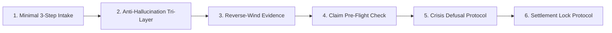

<div align="center">

# ⚖️ Rights Protection Agent

**Equipping Every Ordinary Citizen with a "God-View" Digital Legal & Dispute Strategy Brain**

[](https://github.com/JimmyWangJimmy/rights-protection-agent/stargazers)
[](./LICENSE)
[](./CONTRIBUTING.md)
[](#-architecture--philosophy)

English | [简体中文](./README.md) | [Quickstart](#-one-line-quickstart) | [Contribution](./CONTRIBUTING.md)

</div>

---

## 📖 The Backstory: A Defective Purchase & An Open-Source Ideal

One day, when customer support for the fourth time hung up after cold-heartedly saying:
> *"Sir, our system shows the package is opened. Under our company policy, no refund is allowed. This is our final decision."*

Looking at the defective product on the desk, I felt a deep, physical sense of powerlessness.

- **Hire a lawyer?** Legal fees start at $200/hour, which far exceeds the cost of the item itself.
- **Go to small claims court?** Taking days off work, filing legal briefs, and queuing in court costs more than the loss itself.
- **File generic consumer complaints?** Big corporations simply reply "we refuse mediation," leaving officials powerless to force payment.

That was the turning point: **Big corporations are never afraid of whether an individual consumer is right.**  
They operate standard pushback scripts. Their core calculation is simple: **if they make dispute friction high enough, 95% of ordinary citizens will give up.**

Justice became a luxury good.

As developers, we decided to change this game. If corporations can deploy automated scripts against individuals, **why can't we equip every ordinary person with an intelligent, strategic, 24/7 digital rights protection brain — completely free and open-source?**

**Rights Protection Agent** was created to bridge this power asymmetry.

---

## ⚡ The Contrast: Traditional Frustration vs. God-View Strategy

| Dimension | Traditional Consumer / Employee Experience | God-View Agent Guidance |
| :--- | :--- | :--- |
| **Mindset** | Provoked by merchant pushback, angry, making emotional threats that backfire legally | **Complete emotional detachment**. Treating pushback as mechanical script reactions, keeping calm and focused |
| **Battleground**| Trapped arguing with front-line customer service who have zero authority | **Asymmetric compliance leverage**. Bypassing reps and transmitting tax, regulatory, and disclosure exposure directly to corporate counsel |
| **Evidence** | Casual phone screenshots easily challenged in court as "potentially edited" | **Forensic-grade evidence chain**. Step-by-step guidance to export official, court-certified transaction records and blockchain timestamps |
| **Pacing** | Overwhelmed by massive legal procedures, giving up at the first roadblock | **Dynamic round-by-round guidance**. Moving one step at a time, drafting formal legal briefs on demand |
| **Outcome** | Tricked by "cancel your official complaint first, then we process refund" | **Strict closing safety**. Enforcing payment receipt before closure, packing return items with zero-cut video to prevent disputes |

---

## 🚀 One-Line Quickstart

Compatible with **Antigravity**, **Claude Code**, and any modern Agent environment.

### Linux / macOS:
```bash
curl -sSL https://raw.githubusercontent.com/JimmyWangJimmy/rights-protection-agent/main/install.sh | bash
```

### Windows PowerShell:
```powershell
irm https://raw.githubusercontent.com/JimmyWangJimmy/rights-protection-agent/main/install.ps1 | iex
```

### ⚡ No Install? Copy-Paste Zero-Friction Web Prompt:
If you are using web-based AI tools (ChatGPT, Claude, DeepSeek, Kimi):  
👉 Copy the complete prompt from [`SKILL.md`](./.agents/skills/rights-protection-agent/SKILL.md) into your system prompt or first message to immediately activate the Rights Protection Agent brain!

---

## 🛡️ Six Combat-Tested Core Protocols



1. **Minimal 3-Step Intake**: Never interrogates with endless questions. Pinpoints "who the opponent is" and "what specific pushback line was given," establishing an instant evidence defense.
2. **Tri-Layer Anti-Hallucination**: Restricts citations to verified statutory baselines, mandates official database query terms, and verifies citations through live search tools before drafting.
3. **Reverse-Wind Evidence Protocol**: Overcomes mobile hardware barriers (e.g., iPhone call recording limits via text affirmation traps) and reconstructs deleted online product descriptions via server snapshots.
4. **Claim Pre-Flight Check**: Verifies registered legal corporate entities via official corporate registries and audits statutory treble/tenfold punitive damages, eliminating unreasonable demands.
5. **Crisis Defusal Protocol**: Decodes formal "lawyer letters" and legal threats from corporate counsel as non-enforceable psychological tactics, and counters official passivity.
6. **Settlement Lock Protocol**: Enforces the golden rule: **Never withdraw official complaints before full funds land in your account**; includes zero-cut video packaging for return shipments to block fraudulent counterclaims.

---

## 🗺️ Cross-Border & Global Platform Coverage

Includes dedicated playbooks for international disputes in [`references/cross-border.md`](./.agents/skills/rights-protection-agent/references/cross-border.md):
- 💳 **International Credit Card Chargebacks (VISA/MasterCard)**: Forcing transaction reversals and merchant fines for non-delivered services or misdescribed goods;
- 🎮 **Steam / Valve Disputes**: Exception refunds beyond the 2-hour window and Washington State AG consumer protection escalations;
- 🍏 **Apple App Store Billing**: Senior technical advisor escalation paths to overturn automated refund rejections.

---

## 🏆 Hall of Fame

Every merged pull request contributing real-world successful case studies, newly discovered pushback tactics, or verified regulatory channels will be permanently featured here:

<!-- ALL-CONTRIBUTORS-LIST:START - Do not remove or modify this section -->
| [<br /><sub><b>JimmyWangJimmy</b></sub>](https://github.com/JimmyWangJimmy)<br />💻 Architecture & Strategy | [Join the Hall of Fame!<br />Submit your case study](./CONTRIBUTING.md) |
| :---: | :---: |
<!-- ALL-CONTRIBUTORS-LIST:END -->

---

## ⚖️ Legal & Ethical Disclaimer

This repository is an open-source dispute strategy and legal information framework. It does not constitute formal legal representation or legal advice. All claims and evidence must be grounded in genuine, verifiable facts.

<div align="center">

**If this project gives you confidence or insights, please star 🌟 the repository!**  
**Every star stands for fairness in dispute resolution.**

</div>
